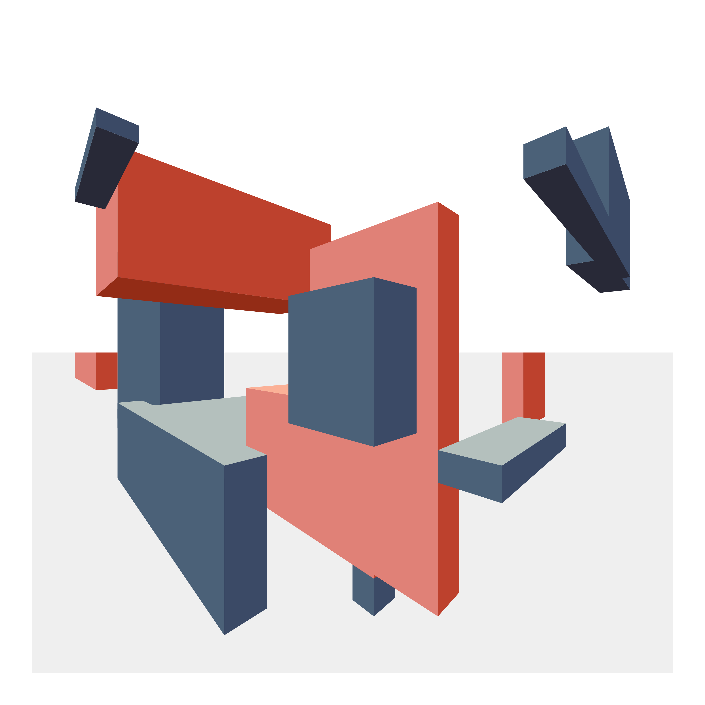
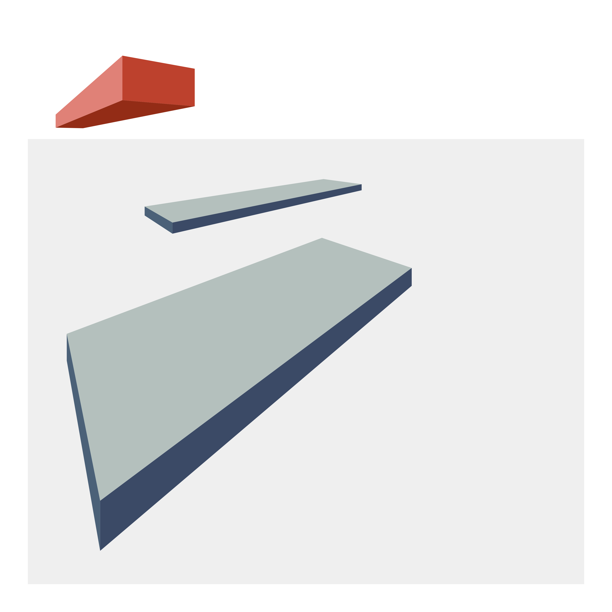
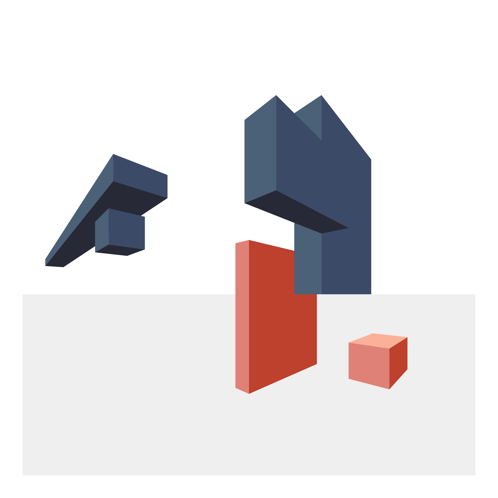

```{r setup, include=FALSE}
knitr::opts_chunk$set(echo = TRUE)
```

# Designing a quilt in R - the original idea
I took up quilting as a creative outlet near the beginning of 2021.
After completing a few projects, I decided to make some original designs.

At the same time, I was seeing a lot of amazing [#Rtistry](https://twitter.com/search?q=%23rtistry) projects shared on Twitter.

So, I thought I would try to create some [generative art](https://en.wikipedia.org/wiki/Generative_art) in R and transform it into a quilt!

This endeavor turned into a large project, roughly divided into the following steps:

  1. I wrote some functions to create a design using ggplot2
  1. I wrote some code to turn my image into something that could be printed as individual quilt blocks
  1. I made the actual quilt!
  1. I revisited how to make my process more general and implement
something useful to design quilts that use foundation paper piecing

In this post, I will go through an overview of part 1.

# Making some aRt

I was inspired by the art of [Fred Kaplan](http://kaplanpicturemaker.com), 
who was my instructor for a couple of continuing education painting
classes. Fred has created some fantastic imagined landscapes that feature geometric structures.

I thought I could create some interesting polygons drawn with 2-point
perspective in ggplot2. Then, I could use fabrics that suggest a light source
with lighter values on some faces and darker values on others.

Here is my final design:

```{r, echo = FALSE}

```

## The basic principle
The first thing I set to do was program the creation of some rectangular polygons drawn with 2-point perspective.

This can be achieved with {ggplot2} using geoms like `geom_path()`,
`geom_segment()`,or `geom_polygon()`.

First, load some packages.

```{r}
library(dplyr, quietly = TRUE) # for data manipulation, pipe
library(ggplot2)               # plot engine
library(retistruct)            # to get intersection of lines

set.seed(45)
```

A box is just 7 or 9 segments.
To draw a box, you need to specify 

+ An x location for the left, center, and right segments
+ A y location for the top and bottom on the center segment
+ The location of the two vanishing points (Here I set the first to (0,0) and 
the second to (some value, 0))

You calculate all the segments' start and stop x and y coordinates from this information. See below the function, `make_new_cube`, that performs this calculation to make a single box.

```{r code_folding=TRUE}
make_new_cube <- function(xes, # a vector of three values between (0, vp)
                          yes, # a vector of two values
                          vp = 10) {
  # pick the vanishing points (y == 0)
  vp <- list(c(0, 0), c(vp, 0))
  # make the center vertical segment
  cube <- data.frame(x = xes[2],
                     xend = xes[2],
                     y = yes[1],
                     yend = yes[2])

  # add the left vertical segment
  new_row <- c(xes[1],
               xes[1],
               (yes[1]/xes[2])*xes[1],
               (yes[2]/xes[2])*xes[1])
  cube <- rbind(cube, new_row)

  # add the right vertical segment
  new_row <- c(xes[3],
               xes[3],
               (yes[1]/(xes[2] - vp[[2]][1]))*(xes[3] -xes[2]) + yes[1],
               (yes[2]/(xes[2] - vp[[2]][1]))*(xes[3] -xes[2]) + yes[2])
  cube <- rbind(cube, new_row)

  # add the top lines
  new_row <- c(cube[1,1], cube[2,1], cube[1,3], cube[2,3])
  cube <- rbind(cube, new_row)
  new_row <- c(cube[1,1], cube[3,1], cube[1,3], cube[3,3])
  cube <- rbind(cube, new_row)

  # add the bottom lines
  new_row <- c(cube[1,1], cube[2,1], cube[1,4], cube[2,4])
  cube <- rbind(cube, new_row)
  new_row <- c(cube[1,1], cube[3,1], cube[1,4], cube[3,4])
  cube <- rbind(cube, new_row)

  # if all above or below y = 0,  then get bottom or top segments
  add_top <- all(c(cube$y, cube$yend) < 0)
  add_bottom <- all(c(cube$y, cube$yend) > 0)

  if (add_top) {
    # intersect left bottom [2,3] to right vp and right bottom [3,3] to left vp
    left_top <- c(xes[1], max(cube[2,3], cube[2,4]))  #left top
    right_p <- vp[[2]] # right vp
    right_top <- c(xes[3], max(cube[3,3], cube[3,4]))  #right top
    left_p <- vp[[1]] # left vp
    poss_top <- line.line.intersection(left_top, right_p,
                                       right_top, left_p,
                                       interior.only = TRUE)
    new_row <- c(poss_top[1], left_top[1], poss_top[2], left_top[2])
    cube <- rbind(cube, new_row)
    new_row <- c(poss_top[1], right_top[1], poss_top[2], right_top[2])
    cube <- rbind(cube, new_row)
  }
  if (add_bottom) {
    # intersect left bottom [2,3] to right vp and right bottom [3,3] to left vp
    left_b <- c(xes[1], min(cube[2,3], cube[2,4]))  #left bottom
    right_p <- vp[[2]] # right vp
    right_b <- c(xes[3], min(cube[3,3], cube[3,4]))  #right bottom
    left_p <- vp[[1]] # left vp
    poss_bottom <- line.line.intersection(left_b, right_p,
                                          right_b, left_p, interior.only = TRUE)
    new_row <- c(poss_bottom[1], left_b[1], poss_bottom[2], left_b[2])
    cube <- rbind(cube, new_row)
    new_row <- c(poss_bottom[1], right_b[1], poss_bottom[2], right_b[2])
    cube <- rbind(cube, new_row)
  }
  return(cube)
}
```

Let's test this function. It makes a nice data frame with our segments.

```{r}
new_xes <- c(1, 2, 3) #left, center, right
new_yes <- c(4, 6) # bottom, top of center

new_cube <- make_new_cube(new_xes, new_yes, vp = 10)
new_cube
```

For the purpose of illustration, I will label the points on the plot.

```{r}
new_cube %>%
  ggplot() +
  geom_segment(aes(x = x, y = y, xend = xend, yend = yend)) +
  geom_label(aes(x = x, y = y, label = paste0("(",x,",",y,")"))) +
  theme_void()
```

## Getting random
To draw polygons in R where the faces would be colored, I rewrote the above `make_new_cube` function to be `make_new_poly`. 
To make it easier to conceptualize, this function default to a view that goes from (0,0) to (100,100).
I also used colors that would suggest a light source, with darker colors on one side and lighter colors on the other.

I then wrote a function `save_my_image` that 

+ Takes as arguments 
  + the number of boxes to make
  + the number of these you want to be in an alternate color
  + the height and width ranges of the boxes
  + You can also customize the location of the horizon line and the colors as desired
+ For each box, it picks a random value for inputs of `make_new_poly`
within the input height and width ranges
+ Creates the "sky" and "ground" and adds all the boxes
+ Displays the image and (optionally) saves a copy to a file
+ Returns the data frame with all the polygons


Here is an example:

```{r eval=FALSE}
design <- save_my_image(out_path = NULL, # don't need to save it
                   height_range = 10:40,
                   width_range = 20:80,
                   n_cubes = 3, 
                   n_second_color = 1,
                   horizon_y = 80)
```

<aside>
```{r, echo = FALSE}

```
</aside>

And another one:

```{r eval=FALSE}
design <- save_my_image(out_path = NULL, # don't need to save it
                   height_range = 60:80,
                   width_range = 20:30,
                   n_cubes = 6, 
                   n_second_color = 2,
                   horizon_y = 40)
```

<aside>
```{r, echo = FALSE}

```
</aside>


# For future work

1. I would have liked to have implemented cast shadows, but I think it would require a major overhaul of my framework. Briefly, you could calculate all the points in 3D and then convert them to a 2D projection.
1. I could better structure and document these functions to make them easier to extend.

The code is available on GitHub [here](https://github.com/awalsh17/quiltR).

### sessionInfo {.appendix}

```{r}
pander::pander(sessionInfo())
```
