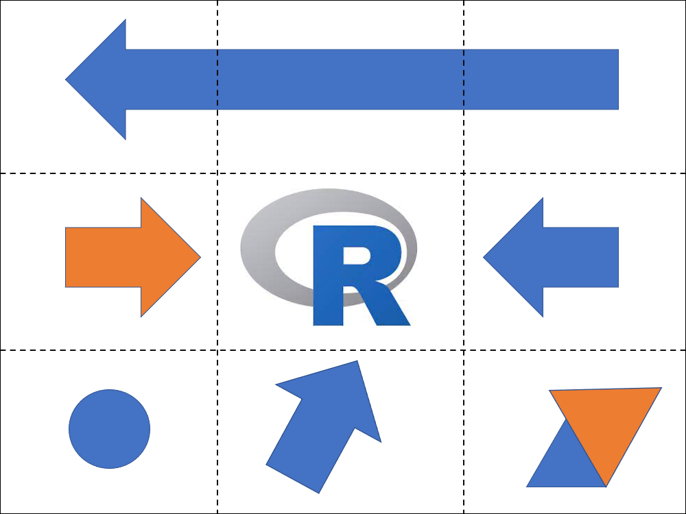
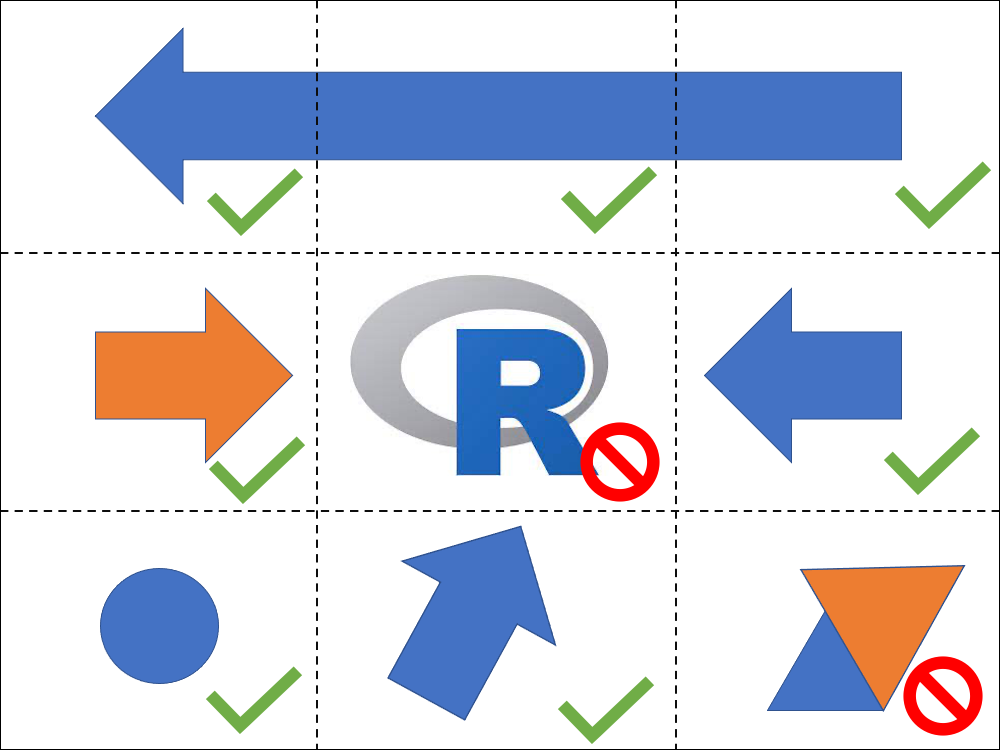
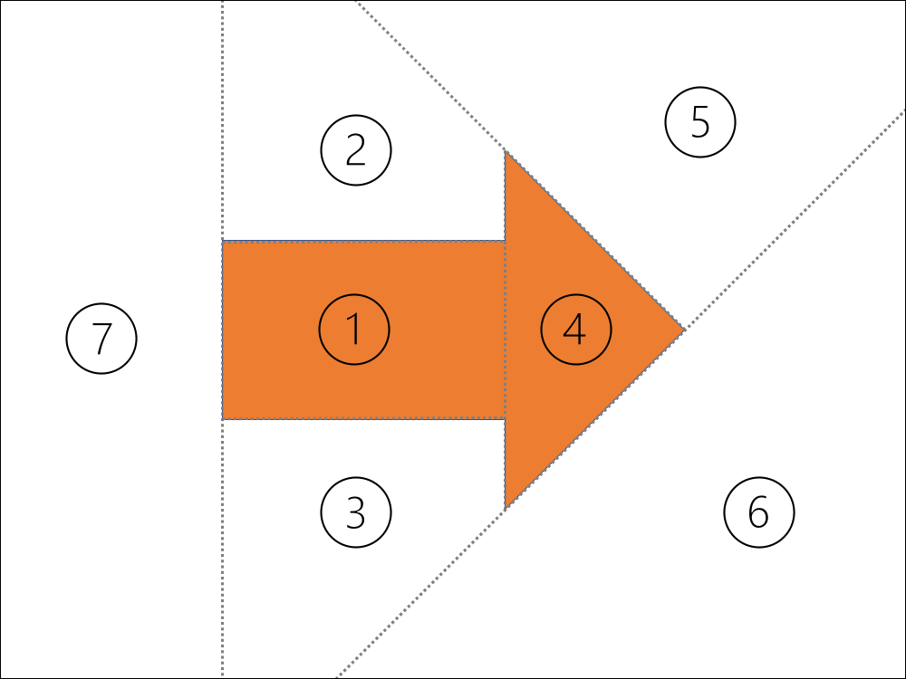
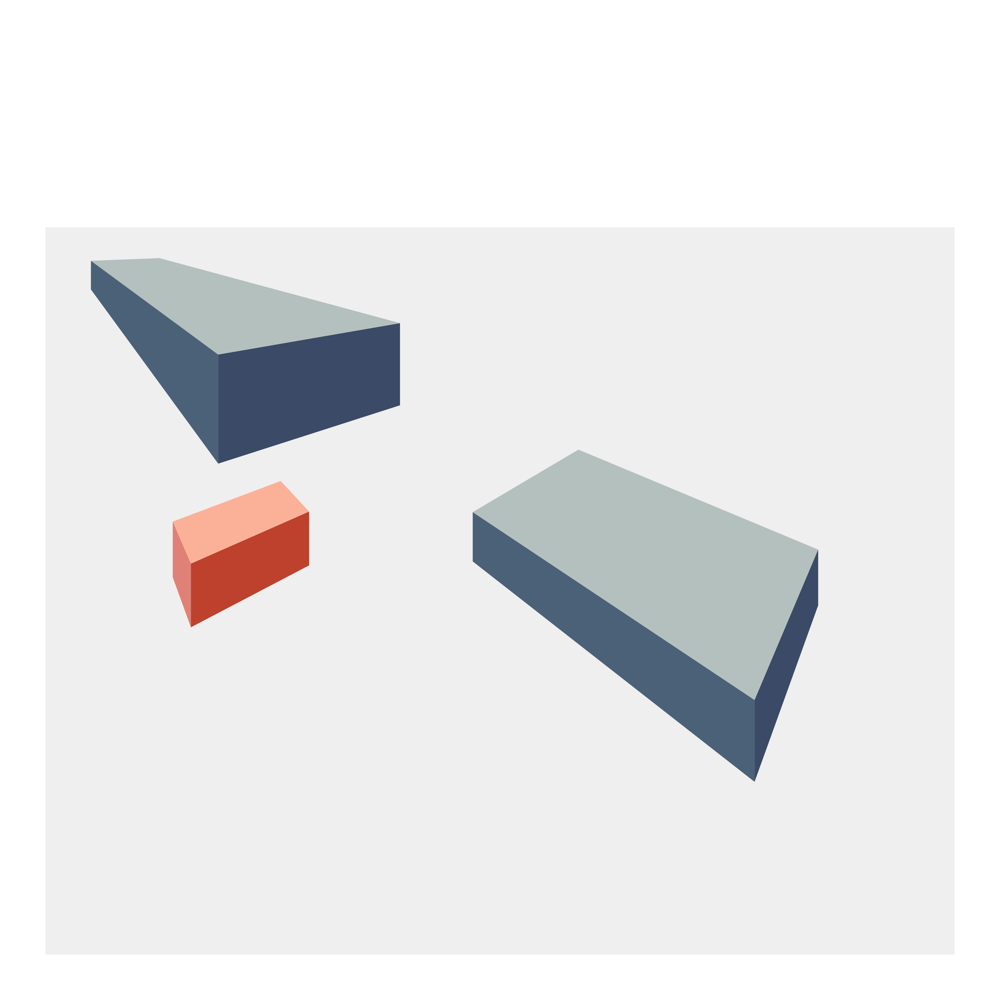
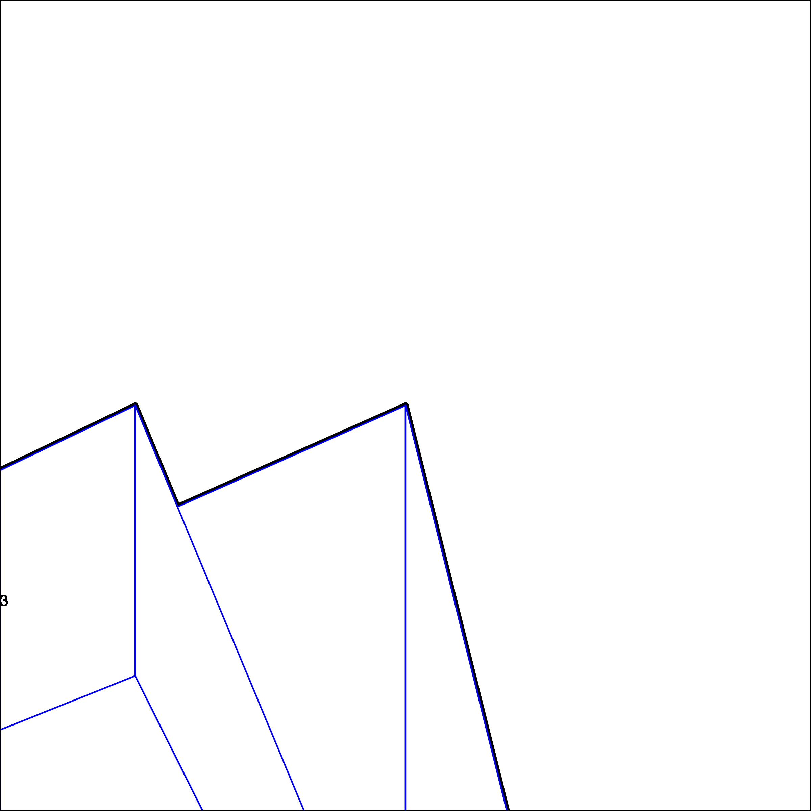
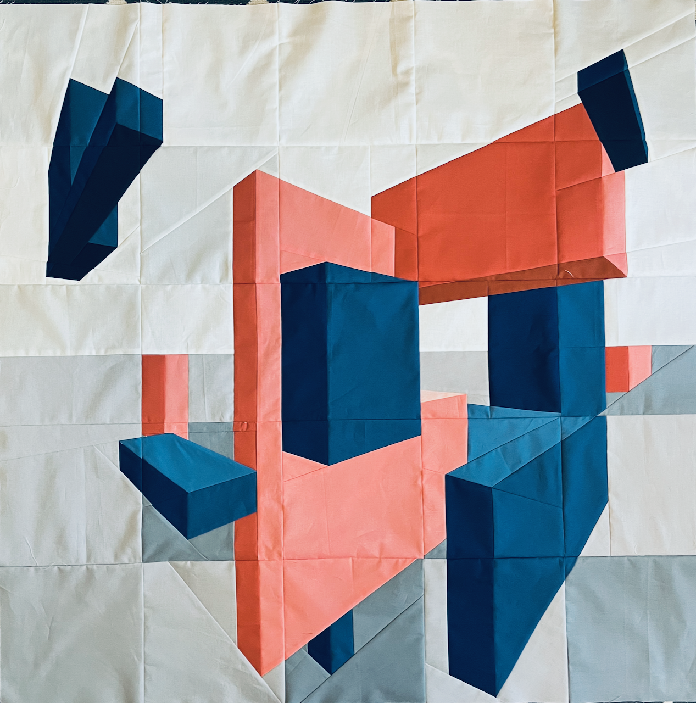

```{r setup, include=FALSE}
knitr::opts_chunk$set(echo = TRUE,
                      fig.align = "center")
```

# Designing a quilt in R

To recap the [previous
post](https://awalsh17.github.io/posts/2022-03-24-quilting-with-r/) on
this topic, I generated a quilt design in R using {ggplot2} and I was
working through my overall plan:

1.  I wrote some functions to create a design using ggplot2 (*post 1*)
2.  I wrote some code to turn my image into something that could be
    printed as individual quilt blocks (*this post*)
3.  I made the actual quilt!
4.  I revisited how to make my process more general and implement
    something useful to design quilts that use foundation paper piecing

In this post, I will go through an overview of part 2.

## The challenge - going from png to fabric

Once I had a design, I needed to figure out how to make the design into
something that could actually be pieced together from fabric.

The approach I used is called [foundation paper
piecing](https://web.stanford.edu/~mleake/projects/paperpiecing/). This
is a technique that enables a quilter to make very intricate and precise
designs by sewing fabric onto a piece of paper sequentially. This
provides stability and precision by sewing along a printed line.

Foundation paper piecing (FPP for short) allows a quilter to make some
incredible creations! Here is a
[link](https://www.quiltcon.com/quiltcon-2022-winners/) to the winners
of this year's Quiltcon awards. The people's choice winner (a portrait
of the artist's family) was made using FPP.

To create an entire FPP quilt, you need to break your larger design into
smaller blocks that are "piece-able." Here is the basic FPP "algorithm"
(typically performed by hand):

A hypothetical starting design (keep in mind that the final quilt will actually be reversed as you sew onto the "wrong" side):

```{r, echo = FALSE}

```

1.  Break the larger design into blocks (usually into blocks that can be
    sewn together into row or columns)

```{r, echo = FALSE}

```

2.  Test whether the blocks are "piece-able" - not all shapes can be
    created!

```{r, echo = FALSE}

```

3.  If the blocks are not "piece-able" - break into smaller blocks

4.  Create the seam lines on the block and label the sections by order

```{r, echo = FALSE}

```

I am planning to save more information on steps 3 and 4 for a future
post.

Here, I will just focus on how to do step 2 easily in R.

## Converting the ggplot into a line drawing

My previous function, `save_my_image()`, creates the design and can save an image.

```{r eval=FALSE}
design <- save_my_image(out_path = NULL, # don't need to save it
                   height_range = 10:40,
                   width_range = 20:80,
                   n_cubes = 3, 
                   n_second_color = 1,
                   horizon_y = 80)
```

```{r, echo = FALSE, out.width="60%", out.height="60%"}

```

I created a new function, `create_pattern_pdf`, that takes the data.frame and plots as line drawing with labeled polygons. The next section breaks down how that works.

## Breaking into pieces

One easy way to separate a large image into smaller blocks is just to
use a program that can do tiled printing (such as Adobe Reader).
However, that doesn't give as much flexibility as you might like to
select where to break up the image.

Below is how I turned a design - which was created on a 2D plane from
(x,y) of (0,0) to (100,100) into a set of pdfs that were 8" by 8" to
print.

*Rescale to the size of the final quilt*

```{r eval=TRUE}
library(dplyr, quietly = TRUE) # used for data manipulations
library(ggplot2) # for plotting
final_quilt_size <- 40 # units are arbitrary (I think in inches)
scale_factor <- final_quilt_size / 100 # my image was "100" wide
width_blocks <- final_quilt_size / 5   # I wanted 5 across, makes nice 8"
```

*Create a data.frame with the start and end x,y for each block*
```{r eval=TRUE}
grid <- tidyr::crossing(x = seq(0, width_blocks * 4, width_blocks),
                        y = seq(0, width_blocks * 4, width_blocks)) %>%
  mutate(x_end = x + width_blocks,
         y_end = y + width_blocks) %>%
  arrange(x, y)

head(grid)
```

*Add in some information that was not in the design created previously*
```{r eval=FALSE}
# Add in the horizontal line (I wanted it at y = 50)
horizontal <- data.frame(cube_id = c("",""),
                         x = c(0, 100),
                         y = c(50, 50)) %>%
  mutate(x = x*scale_factor, y = y*scale_factor)
# This ensures that the paths are "closed" without any open edges
missing_paths <- design %>% arrange(desc(cube_id))
```

*Loop through each block, plot and label, save out to a file. I tried to label each face an index to indicate color, but in my final design there were overlapping polygons, so colors needed to be manually checked for each block.*

```{r eval=FALSE}
for (i in seq_len(nrow(grid))) {
  block <- design %>%
    bind_rows(missing_paths) %>%
    arrange(cube_id) %>%
    mutate(x = x*scale_factor, y = y*scale_factor) %>%
    group_by(id) %>%
    mutate(ave_x = mean(x), ave_y = mean(y)) %>%
    group_by(value) %>%
    mutate(color = cur_group_id()) %>%
    ungroup() %>%
    ggplot() +
    # horizon line
    geom_path(aes(x = x, y = y, group = cube_id),
              data = horizontal,
              color = "black",
              size = 1) +
    geom_polygon(aes(x = x, y = y, group = id),
                 fill = "white", color = "blue",
                 size = 1,
                 alpha = 1) +
    geom_text(aes(label = color, x = ave_x, y = ave_y)) +
    coord_equal(clip = "off",
                xlim = c(grid$x[i], grid$x_end[i]),
                ylim = c(grid$y[i], grid$y_end[i]),
                expand = FALSE) +
    theme_void() +
    theme(legend.position = "none",
          panel.border = element_rect(colour = "black", fill=NA, size=0.5))
  ggsave(plot = block,
         filename = paste0("to_print/",i,".pdf"),
         width = width_blocks, height = width_blocks)
}
```

<aside>
<br>
<br>
<br>
<br>
<br>
<br>
<br>
<br>
<br>
<br>
One trick to plot only certain limits of the image *without* removing data is to set the limits within `coord_equal()`.
<br>
<br>
<br>
Note that I used `theme_void()` again to remove most the axis information and gridlines. 
<br>
<br>
<br>
Further, I added back in a panel.border, which will be very useful when I go to make the blocks. 
</aside>

For illustration purposes, here is what one of the blocks looked like.
Now I could print (at 100% scale) and the squares were a perfect 8 inches.

```{r, echo = FALSE, out.width="60%", out.height="60%"}

```

## The finished quilt top

Here is a preview of the completed quilt top. 
I still need to actually quilt it, but the top does look like the original design! 

```{r, echo = FALSE, out.width="60%", out.height="60%"}

```

The code is available in a GitHub
[repo](https://github.com/awalsh17/quiltR).

### sessionInfo {.appendix}

```{r}
pander::pander(sessionInfo())
```
