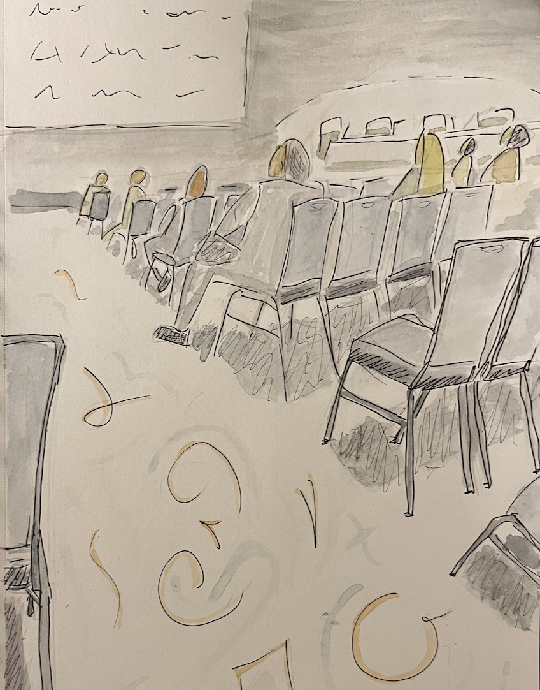

```{r setup, include=FALSE}
knitr::opts_chunk$set(echo = TRUE)
set.seed(202204)
```

```{r, echo = FALSE, fig.align='center', out.width='30%'}

```

<aside>
A sketch of my experience in the convention center.
</aside>

I attended the American Association of Cancer Research (AACR) annual meeting in New Orleans from April 10th-13th. This was my first in-person conference in over two years!

I am recapping my take-aways here at two levels:

+ On the ground: snippets of interesting science I saw
+ From the clouds: thoughts on return to in-person meetings and networking

__On the ground:__

1. Canine oncology
   + There was a presence from canine oncology companies, [Fidocure](https://www.fidocure.com/) and [PetDx](https://petdx.com/) as well as posters from veterinary oncologists from the University of Florida (abstract [5030](https://www.abstractsonline.com/pp8/#!/10517/presentation/18417)) and the University of Pennsylvania (abstract [1344](https://www.abstractsonline.com/pp8/#!/10517/presentation/14549) and [1363](https://www.abstractsonline.com/pp8/#!/10517/presentation/14571)) among others.
   + According to Fidocure, there are 6 million new cancer diagnoses in dogs annually versus less than 2 million cases in humans.
   + I am interested in where this research develops. Canines are an exciting model for human cancer from a genomic similarity and environment similarity point of view. It is attractive to imagine the shared benefit of finding drugs that work both in humans and dogs. 

2. Data science, AI, computational biology, etc.
   + Overall, I didn't see anything super exciting or anything super depressing. There was a good balance of approaches advanced by both academic and industry teams.
   + There was a session chaired by Trey Ideker called "Interpreting and Building Trust in Artificial Intelligence Models." that included talks from Eli Van Allen and Su-In Lee. I enjoyed reading this [preprint](https://www.biorxiv.org/content/10.1101/2021.10.06.463409v1.full.pdf) from Dr. Lee's group after the meeting.
   + There was another session chaired by Olga Troyanskaya called "Artificial Intelligence in Cancer Research and Care" that included talks from Dana Pe'er and John Quackenbush.
   + I also attended a mini-symposium called "Emerging Topics in Computational Oncology," chaired by Ben Greenbaum, and Ben Raphael which featured several interesting talks on a broad range of topics.

3. Biomarkers
   + I enjoyed the talks from former BMS colleagues (Jonathan Baden and Jaclyn Neely) who discussed comparing bTMB and tTMB, and biomarker work from Nivolumab HCC clinical studies (abstracts [2134](https://www.abstractsonline.com/pp8/#!/10517/presentation/12536) and [2145](https://www.abstractsonline.com/pp8/#!/10517/presentation/12567)).
   + Foundation Medicine and collaborators from the University of Minnesota presented a poster on their latest HRD model (abstract [1249](https://www.abstractsonline.com/pp8/#!/10517/presentation/12663)). Their model used XGBoost on DNA sequencing features to predict homologous recombination deficiency (HRD) and showed the predicted HRD across tumor types and the concordance with other HRD biomarkers (e.g., gLOH). This work is similar to models recently published in a [preprint](https://www.medrxiv.org/content/10.1101/2021.12.20.21267985v1) from Tempus that uses RNA features to predict HRD.
   + Spatial transcriptomics and single-cell 'omics continue to capture the imagination of cancer researchers. There were a lot of posters and talks. I am excited to see that the challenges encountered by early adopters seem to be getting resolved. I am optimistic that additional (clinically actionable) insights will emerge beyond the technical "we can make the data."

__From the clouds:__

1. I need new glasses. I haven't looked at a screen farther than 20 inches away in a long time.
2. I missed everyone! It was great connecting with present, past, and (hopefully) future colleagues and collaborators. Unfortunately, we haven't figured out how to make virtual conferences as effective for creating and building connections.
3. Highlighting new voices versus established researchers. Sometimes it can be boring to see the same stars giving similar talks, and I tend to skip those. I prefer talking with folks at their posters and chatting with other people after the sessions. I am thankful to all the people who were so friendly and welcoming to discuss ideas with me.
4. Diversifying cancer research
   + AACR gives [awards](https://www.aacr.org/professionals/meetings/aacr-travel-grants/aacr-minority-scholar-in-cancer-research-awards/2022-minority-scholar-in-cancer-micr-research-awardees/) to recognize and fund travel for minority researchers, and I hope that we can do more to diversify cancer research (both the researchers and the patients).
   + There were some fantastic posters and talks that highlighted the need for more diverse clinical trials and the differences in cancer patients based on genetic ancestry.
   + Coincidentally, on April 13th, the FDA published new [guidance](https://www.fda.gov/news-events/press-announcements/fda-takes-important-steps-increase-racial-and-ethnic-diversity-clinical-trials) on improving diversity in clinical trial participants.

### sessionInfo {.appendix}

```{r}
pander::pander(sessionInfo())
```
