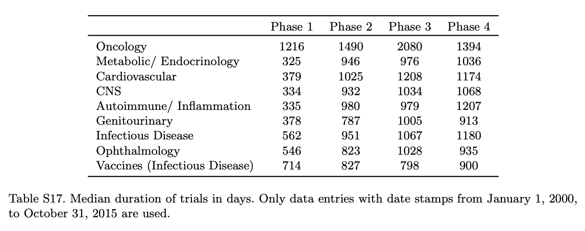

```{r setup, include=FALSE}
knitr::opts_chunk$set(echo = TRUE)
```

I work in drug development, where we often discuss two things:

-   It takes too long to develop drugs
-   It costs too much to develop drugs (and it is getting more expensive)

This observation is sometimes referred to as [Eroom's law](https://en.wikipedia.org/wiki/Eroom%27s_law) (Moore's law backward).

In this post, I look at clinical trial data and make a couple of visualizations.

<aside>This post is mainly for future me to remind myself how to work with clinicaltrials.gov data and some {ggplot2} code that I often forget (annotating and customizing plots).</aside>

## Background

Many researchers have studied drug development trends and examined possible approaches to increase the probability of success and decrease the time and costs of bringing a good drug to market.

For example:

-   [This report on 2006-2015](https://www.bio.org/sites/default/files/legacy/bioorg/docs/Clinical%20Development%20Success%20Rates%202006-2015%20-%20BIO,%20Biomedtracker,%20Amplion%202016.pdf) from BIO, Informa, Amplion

> The overall likelihood of approval (LOA) from Phase I for all developmental candidates was 9.6%, and 11.9% for all indications outside of Oncology.

-   [This update for 2011-2020](https://go.bio.org/rs/490-EHZ-999/images/ClinicalDevelopmentSuccessRates2011_2020.pdf?_ga=2.28974780.1613804053.1661549185-832102751.1661549185)

> The overall likelihood of approval (LOA) from Phase I for all developmental candidates over 2011--2020 was 7.9%. On average, it takes 10.5 years for a Phase I asset to progress to regulatory approval. Disease areas with above-average LOAs tend to have the shortest development timelines.

-   Several publications have shown that targets with human genetic evidence are more likely to be successful ([Ochoa et al, 2022](https://doi.org/10.1038/d41573-022-00120-3), [King et al, 2019](https://doi.org/10.1371/journal.pgen.1008489), [Nelson et al., 2015](https://doi.org/10.1038/ng.3314))
-   Publications have also shown that drugs with patient selection biomarkers are more likely to be successful ([Wong et al, 2019](https://doi.org/10.1093/biostatistics/kxx069))

## What data is available?

Most of the papers and reports cited above use data from proprietary databases that are not available for free. Or they performed some challenging (or even heroic) data integration.

I wanted to explore what was publicly available and at least re-create the plots in those reports.

## How long does each phase of development take?

I will use data from [clinicaltrials.gov](https://www.clinicaltrials.gov/). There are many ways to interact with this data, such as [the API](https://www.clinicaltrials.gov/api/gui). Some R packages exist to work with this data in R, but I have not tested them.

Here, I downloaded a snapshot of the data from the [AACT database](https://aact.ctti-clinicaltrials.org/pipe_files), which provides a relational database that downloads data from clinicaltrials.gov daily. These snapshots are relatively large (\~1.4 GB).

**Load packages**

```{r}
library(dplyr)
library(readr)
library(ggplot2)

# set up plot preferences
theme_set(theme_minimal(base_family = "Avenir Next"))
palette_colors <- c("#c1e7ff", "#6996b3", "#004c6d")
```

**Load clinicaltrials.gov data**

I loaded a small set of tables (out of 50 total) that I need from the 2022-08-30 snapshot as a list of data.frames in R.

```{r}
path_to_data <- "~/AACT/20220830/"
tables_to_read <- rlang::set_names(c("studies", "interventions", "conditions",
                                     "sponsors", "designs"))
db <- lapply(tables_to_read, 
             function(table) read_delim(paste0(path_to_data, table, ".txt"),
                                        delim = "|"))
```

**Filter to the desired studies**

The data contained information on over 400,000 studies with the earliest entries dating to 1999.

The code below filters to the studies I am most interested in.

-   Only used "Completed" or "Terminated" studies
-   Restricted to completion dates between 2000-01-01 and 2019-12-31
-   Removed trials that started and ended on the same day
-   Restricted to Phase 1, 2, or 3 (removing things like "Early Phase 1" and many "Not Applicable"/NA. This also removes terms like "Phase1/Phase2", which we may want to keep)
-   Restricted to "Drug" or "Biological" intervention types (removing device, behavioral, etc.)
-   Restricted to studies where the lead sponsor was industry (not academic or government)
-   Restricted to studies that list the primary purpose as "Treatment" or "Prevention" (not basic science, diagnostic, or other)
-   Many other filters might be considered. Some of these trials might not be very informative if we are interested only in novel drug development. For example, some of these trials test a new formulation or delivery method.

```{r code_folding=TRUE}
selected_trials <- 
  db$studies %>% 
  filter(overall_status %in% c("Completed", "Terminated"),
         phase %in% c("Phase 1", "Phase 2", "Phase 3"),
         study_type == "Interventional",
         completion_date >= as.Date("2000-01-01"),
         completion_date <= as.Date("2019-12-31")) %>% 
  select(nct_id, phase, number_of_arms, source, enrollment,
         overall_status, study_type, 
         completion_date, completion_date_type,
         start_date, start_date_type,
         brief_title, official_title,
         results_first_posted_date, study_first_posted_date) %>% 
  semi_join({db$interventions %>%
      filter(intervention_type %in% c("Drug", "Biological"))},
      by = "nct_id") %>%
  inner_join({db$conditions %>% 
      tidyr::nest(conds = c(-nct_id))},
      by = "nct_id") %>% 
  semi_join({db$sponsors %>%
      filter(lead_or_collaborator == "lead" & agency_class == "INDUSTRY")},
      by = "nct_id") %>%
  inner_join({db$designs %>%
      filter(primary_purpose %in% c("Treatment", "Prevention")) %>%
      select(nct_id, intervention_model, primary_purpose)},
      by = "nct_id") %>%
  mutate(completion_days = 
           as.numeric(completion_date - start_date),
         completion_months = completion_days / 30.417) %>% 
  filter(completion_days > 0)
```

The filtered data is a fraction of the original database, but still contains a large number of trials to further investigate.

```{r}
n_distinct(selected_trials$nct_id)
```

**Group trials by therapeutic area**

I wanted to split the data by therapeutic area (e.g., cancer, infectious diseases). The database has MeSH terms in the *browse_conditions* table that are populated by the National Library of Medicine using an algorithm (according to the [data dictionary](https://aact.ctti-clinicaltrials.org/data_dictionary)). The *conditions* table has the data as submitted to clinicaltrials.gov (not drawn from a controlled vocabulary).

[MeSH](https://en.wikipedia.org/wiki/Medical_Subject_Headings) is a controlled vocabulary for medical terms created by the US National Library of Medicine. One can use [MeSH RDF](https://hhs.github.io/meshrdf/sample-queries) to query MeSH terms. Initially, I thought this would be an efficient way to categorize trials by therapeutic area, but I did not end up using that data.

After looking through this data for some time, it seems that the MeSH terms in *browse_conditions* are sometimes overly liberal and add terms that don't seem applicable. Therefore, I used the *conditions* table and came up with a list of terms to search for instead of more systematic filtering by MeSH terms.

<aside>It would merit a more careful consideration of "Healthy" for phase 1 studies. "Healthy" is the most common condition in this dataset. Overall, I believe this approach is much too conservative and I am missing trials for a given therapeutic area.</aside>

```{r ta_process}
terms_tas <- data.frame(
  "therapeutic_area" = c("oncology", "cardiovascular", "metabolic"),
  "pattern" = c(
    "carcinoma|glioblastoma|glioma|tumor|cancer|leukemia|
    leukaemia|lymphoma|melanoma|neoplasm|myeloma|malignancy|metastasis",
    "cardio|artery|ventricular|ischemia|angina|
    aortic|arteriosclerosis|aneurysm|myocardial|hypertension|
    stroke|coronary|heart[^b]|cardiovascular|atrial",
    "obesity|diabetes|metabolic|overweight|insulin"
  )
)
```

**Create some plots**

Some notes on the plot:

-   I converted days to months by dividing by 30.417.
-   I created a new data.frame with the median durations by phase to make adding the text and arrow annotations easier.
-   I tried to guess a good place for the text annotations based on the data in a simple way. There are many ways to do this. I could have used `x = Inf`, `y = Inf` to place text in the top-right corner, but this was not compatible with adding the arrow.
-   I made a quick function (`convert_duration_text`) to convert the duration to easier-to-understand units. In other words, convert 1039 days to "2 yrs 10 mos". I am guessing there is an alternate method to do this with existing packages like {lubridate}.

```{r code_folding=TRUE}
# make helper functions to calc and plot
convert_duration_text <- function(days) {
  results <- rep(NA_character_, length(days))
  
  results[days < 31] <- {
    day_label <- ifelse(days[days < 31] == 1, "day", "days")
    paste(days[days < 31], day_label)
  }
  
  results[days >= 31 & days < 365] <- {
    months <- round(days[days >= 31 & days < 365] / 30.417, 1)
    month_label <- ifelse(months == 1, "mo", "mos")
    paste(months, month_label)
  }
  
  results[days >= 365] <- {
    years <- floor(days[days >= 365] / 365.25)
    left_days <- days[days >= 365] %% 365.25
    months <- round(left_days / 30.417)
    year_label <- ifelse(years == 1, "yr", "yrs")
    month_label <- ifelse(months == 1, "mo", "mos")
    paste(years, year_label, months, month_label)
  }
  
  return(results)
}

# Plotting function
plot_time_by_ta <- function(data, therapeutic_area) {
  
  ta_pattern <- terms_tas$pattern[terms_tas$therapeutic_area == therapeutic_area]
  
  filt_data <- data %>%
    tidyr::unnest(conds) %>% 
    filter(grepl(ta_pattern, downcase_name)) %>% 
    distinct(nct_id, phase, completion_date, completion_days,
             completion_months, start_date) %>% 
    filter(!is.na(completion_days)) %>% 
    group_by(phase) %>% 
    mutate(groups = paste0(phase, "\nn = ", n())) %>% 
    ungroup()
  
  filt_medians <- filt_data %>% 
    group_by(groups) %>% 
    summarise(medians = median(completion_months),
              peak_at_med = sum(between(completion_months,
                                        medians - 12, medians)),
              median_days = median(completion_days)) %>% 
    # set the position for the labels
    mutate(x1 = medians + 40, 
           x2 = medians, 
           y1 = max(peak_at_med) * 0.85, 
           y2 = max(peak_at_med) * 0.8, 
           median_label = paste0("median:\n",
                                 convert_duration_text(median_days)))
  
  filt_data %>% 
    ggplot(aes(x = completion_months, fill = groups)) + 
    geom_histogram(position = "identity", alpha = 1, binwidth = 12) + 
    geom_vline(aes(xintercept = medians),
               data = filt_medians,
               linetype="dashed", color = "gray40") +
    geom_text(aes(label = median_label,
                  x = x1,
                  y = y1),
              data = filt_medians, 
              size = 3,
              nudge_x = 3, nudge_y = 3,
              hjust = 0, vjust = 0,
              family = "Avenir Next") +
    geom_curve(aes(x = x1, y = y1, xend = x2, yend = y2),
               data = filt_medians,
               color = "gray40",
               curvature = -0.3,
               arrow = arrow(length = unit(0.05, "npc"), type = "closed")) + 
    scale_fill_manual(values = palette_colors) + 
    facet_wrap(~groups, nrow=1) +
    labs(x = "time in months",
         y = "# of trials", 
         title = "How long do clinical trials take?",
         subtitle = paste(therapeutic_area, "therapeutic area")) + 
    theme(legend.position = "none",
          panel.grid.minor = element_blank(),
          text = element_text(size=11),
          strip.text.x = element_text(size = 13))
}
```

```{r}
plot_time_by_ta(selected_trials, "oncology")
```

```{r}
plot_time_by_ta(selected_trials, "cardiovascular")
```

Overall, these numbers align with expectations from other studies like Wong *et al.* They show in Supplemental Table 17 the median duration for different therapeutic areas. My understanding is that this analysis included all trials (including non-industry sponsored).

<aside>My estimates are shorter, which I believe is due mainly to the filters I applied.</aside>



## Do biomarkers improve the probability of success?

Clinicaltrials.gov data contains information on the inclusion and exclusion criteria for each study. However, it is currently challenging to extract information automatically on trial design, such as the type of biomarkers used.

[Wong et al., 2019](https://doi.org/10.1093/biostatistics/kxx069) presents data on the probability of success of clinical trials conditioned on biomarker use. The authors used [citeline](https://pharmaintelligence.informa.com/products-and-services/clinical-planning/citeline) data. I do not have access to this data, but the authors provided some summary data in the paper that I can re-plot. I used the aggregated summary data from Table 3.

> Table 3. POS of drug development programs with and without biomarkers, using data from January 1, 2005, to October 31, 2015, computed using the phase-by-phase method. These results consider only trials that use biomarkers in patient stratification. Since for the majority of trials using biomarkers (92.3%) their status is observed only on or after January 1, 2005, the choice of the time period is to ensure a fair comparison between trials using and not using biomarkers. SE denotes standard error.

Here, I am just plotting the oncology results.

Some notes on the plot:

-   I use `stringr::str_wrap()` to easily convert long facet labels to less wide versions that won't overlap each other
-   I move the legend to a custom position and also move the facet labels

**Load and plot the data**

```{r code_folding=TRUE}
wong_t3 <- read_csv("data/wongetal_all_table3.csv")

wong_t3 <- wong_t3 %>% 
  filter(category != "All",
         TA == "Oncology") %>% 
  select(-total_phase_transitions) %>%
  mutate(phase = stringr::str_wrap(phase, width = 10),
         phase = forcats::fct_inorder(phase)) %>% 
  group_by(phase) %>% 
  mutate(percent_increase = paste0("+", POS[2] - POS[1], "%")) %>% 
  ungroup()

wong_t3 %>% 
  ggplot(aes(x = category, y = POS, fill = category)) +
  geom_col()+
  geom_errorbar(
    aes(ymin = POS - SE, ymax = POS + SE), 
    width = 0.7,
    color = "gray40") + 
  geom_curve(
    aes(x = 1, y = `POS_No biomarker` + 7,
        xend = 1.5, yend = `POS_With biomarker`),
    data = tidyr::pivot_wider(
      wong_t3, 
      names_from = category, 
      values_from = c("POS", "SE")),
    inherit.aes = F,
    color = "gray40",
    linetype = "solid",
    size = 0.5,
    curvature = -0.2,
    arrow = arrow(length = unit(0.1, "npc"))) +
  geom_text(
    aes(label = percent_increase, y = POS + SE),
    data = filter(wong_t3, category == "No biomarker"),
    family= "Avenir Next", 
    size = 3.5,
    nudge_y = 3 ) +
  scale_fill_manual(values = palette_colors) +
  facet_wrap(~phase, nrow = 1, strip.position = "bottom") + 
  labs(x = NULL,
       y = "POS (% +/- SE)", 
       fill = NULL) +
  theme(legend.position = c(0.15, 0.85), 
        legend.background = element_rect(fill="white", color = "white"),
        axis.text.x = element_blank(),
        strip.text.x = element_text(size = 11))
```

## Some thoughts

-   This high-level view does not consider the time it takes to optimally position a therapy to reach the *right* patients that could benefit. (It is a valuable exercise to plot the cumulative number of trials for a given investigational or approved drug over time and the number of new approvals for that drug.)
-   The clinicaltrials.gov data and the AACT database are tremendous resources. However, generally, you need to join in some orthogonal data to answer questions. For example, you cannot easily parse from the data model which interventions were the investigational arm versus the comparator arms (if applicable). Some of the curation needed to augment the data is available through proprietary databases and ontologies that can better resolve drug name synonyms and classify trials and therapies in greater detail.

## sessionInfo {.appendix}

```{r}
sessionInfo()
```
