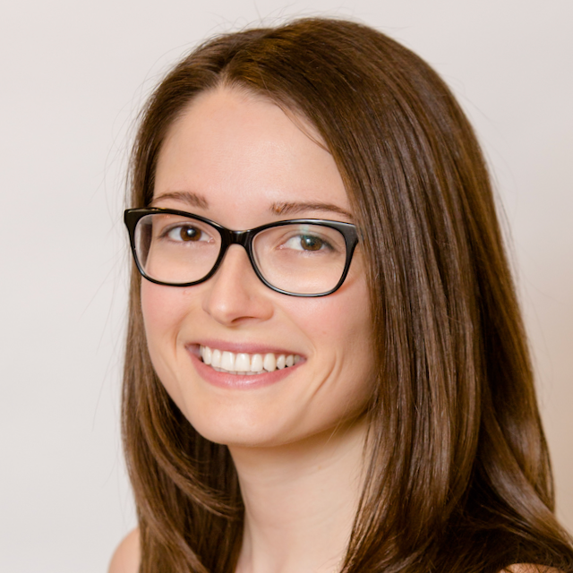

```{r setup, include=FALSE}
knitr::opts_chunk$set(echo = FALSE)
```

```{r, echo = FALSE, fig.align='center', out.width='30%'}

```

I am a computational biologist/data scientist/bioinformatician/bioengineer that enjoys learning from complex biological data sets and collaborating. (My pronouns are she/her.)

I am currently VP of Translational Research at [Pathos](https://pathos.com). My prior professional experience includes roles at Bristol Myers Squibb and Janssen. My projects are broadly at the intersection of molecular data and drug development, including leading teams that have worked on all stages of drug development, from target identification through approval. [Google Scholar page](https://scholar.google.com/citations?user=G9Icw9EAAAAJ&hl=en).

I am also a founding organizer of the [Philadelphia chapter](https://www.rladiesphilly.org) of [R-Ladies](https://rladies.org). 

I live in the Philadelphia area. I spend my free time watching television and improving my artistic skills through painting, quilting, needlepoint, and other creative pursuits.

You can find me online on [Twitter](https://twitter.com/sciencealice), [LinkedIn](https://www.linkedin.com/in/alice-walsh/), and [GitHub](https://github.com/awalsh17).
